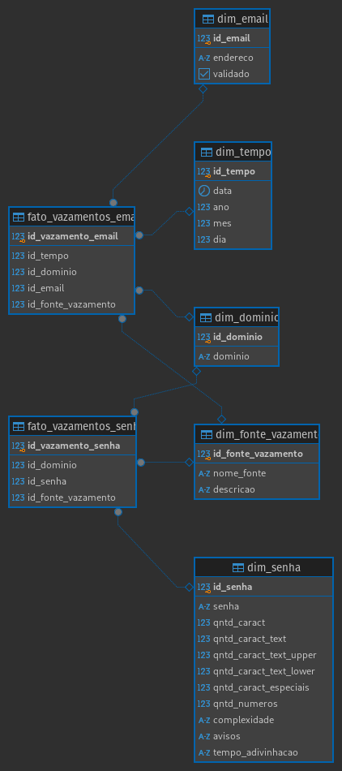

# Projeto de Processamento de Vazamentos de Dados

Este projeto tem como objetivo processar arquivos contendo informações de URLs, e-mails e senhas vazadas, avaliando a complexidade das senhas e inserindo as informações em um banco de dados PostgreSQL.

## Instruções para Execução

### 1. Criar um Ambiente Virtual (venv)

Para garantir que o projeto funcione corretamente, é recomendado o uso de um ambiente virtual. Para criar e ativar o ambiente virtual, siga os passos abaixo:

```bash
# Criar o ambiente virtual
python -m venv venv

# Ativar o ambiente virtual no Linux/Mac
source venv/bin/activate

# Ativar o ambiente virtual no Windows
venv\Scripts\activate
```

### 2. Instalar Dependências

Com o ambiente virtual ativado, instale as dependências do projeto utilizando o arquivo requirements.txt:

```bash
pip install -r requirements.txt
```

### 3. Criar o Diretório `input`

Certifique-se de que o diretório `input` exista na raiz do projeto. Este diretório será usado para armazenar os arquivos de entrada com os dados de vazamento.

```bash
# Criar o diretório input
mkdir input
```

### 4. Criar o Arquivo `.env`
  
Este projeto usa variáveis de ambiente para configurar a conexão com o banco de dados PostgreSQL. Crie um arquivo .env na raiz do projeto com base no arquivo de exemplo .env.example.

```env
DB_NAME=nome_do_banco
DB_USER=usuario
DB_PASSWORD=senha
DB_HOST=localhost
DB_PORT=5432
```
### 5. Criar o Banco de Dados

O projeto inclui um arquivo `./db/utils/ddl.sql`, que contém as instruções SQL para criar todas as tabelas necessárias no banco de dados PostgreSQL.

Para criar as tabelas, execute o arquivo ddl.sql após configurar o banco de dados:

```bash
psql -h localhost -U seu_usuario -d seu_banco -f ./db/utils/ddl.sql
```

Esse arquivo vai criar as seguintes tabelas no banco de dados:

- dim_tempo
- dim_dominio
- dim_email
- dim_senha
- dim_fonte_vazamento
- fato_vazamentos_email
- fato_vazamentos_senha

<br>

> Modelo de DataWarehouse




Certifique-se de que o banco de dados esteja corretamente configurado antes de continuar.

### 5. Padrão dos Arquivos no Diretório `input`

Os arquivos que o projeto processa devem seguir um padrão específico no nome, com a seguinte estrutura:

```md
YYYY-MM-DD_Plataforma-origem.txt
YYYY-MM-DD_Plataforma-origem.csv
```

- YYYY-MM-DD: Data em que o arquivo foi gerado.
- Plataforma-origem: O nome da plataforma de onde os dados foram vazados (por exemplo, "Facebook", "LinkedIn").
- **Extensões aceitas: .txt ou .csv.**

Exemplo de nomes válidos:

- 2024-01-15_Facebook.txt
- 2023-12-22_LinkedIn.csv

### 6. Executando o Projeto

Para executar o projeto e processar os arquivos, certifique-se de que seu ambiente está configurado corretamente (ambiente virtual ativo, dependências instaladas e arquivo .env configurado). Depois, execute o script principal:

```bash
python main.py
```

Você será solicitado a selecionar um arquivo do diretório input e informar o separador utilizado no arquivo (por exemplo, |, ,, :).

### 7. Avaliação de Senhas

O projeto também usa o pacote [zxcvbn](https://github.com/dropbox/zxcvbn) para avaliar a complexidade das senhas, fornecendo feedback sobre como melhorá-las. Para mais detalhes sobre como isso funciona, consulte o código do arquivo main.py.

### 8. Estrutura do Projeto

- input/: Diretório onde os arquivos de dados devem ser colocados.
- main.py: Script principal que gerencia o fluxo do programa.
- .env: Arquivo de configuração com as credenciais de acesso ao banco de dados.
- requirements.txt: Lista de dependências do projeto.
- README.md: Este arquivo com instruções para instalação e uso.